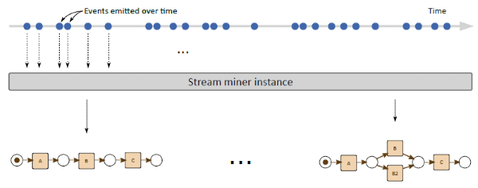

---
hide:
  - navigation
  - toc
---

# Beamline Framework

Beamline is a *Java framework* designed to facilitate the prototyping and the development of ***streaming process mining*** algorithms.

The framework is designed around the [ReactiveX framework](https://reactivex.io/) (and its [RxJava implementation](https://github.com/ReactiveX/RxJava)) which allows composing asynchronous and event-based programs by using observable sequences.

## Streaming process mining

[Process mining](https://en.wikipedia.org/wiki/Process_mining) is a well establish discipline, aiming at bridging data science and process science together, with the ultimate goal of improving processes and their corresponding executions.

Classical process mining techniques take as input so-called *event log files*: static files containing executions to be analyzed. These event log files are typically structured as XML files according to the [IEEE XES standard](https://xes-standard.org/). These files contain events referring to a fixed period of time and, therefore, the results of the process mining analyses refer to the same time frame.

In [streaming process mining](https://andrea.burattin.net/publications/2018-encyclopedia), the input is not a static file, but an *event stream*. As in [event stream processing](https://en.wikipedia.org/wiki/Event_stream_processing), in streaming process mining the goal is to analyze data immediately and update the analysis immediately.

The picture below refers to the control-flow discovery case but, obviously, the same principle applies when [conformance checking](https://en.wikipedia.org/wiki/Conformance_checking) or enhancement algorithms are considered.

<figure markdown> 
  
  <figcaption>
    Conceptualization of the streaming process discovery. 
    Image source: A. Burattin, A. Sperduti, and W. van der Aalst. Control-
flow Discovery from Event Streams. In Proc. of IEEE WCCI-CEC, 2014.</figcaption>
</figure>

## Beamline

Beamline is a Java framework meant to simplify the research and the development of streaming process mining, by providing a set of tools that can lift researchers from the burden of setting up streams and running experiments.

!!! note "On the name Beamline"
    The term *Beamline* is borrowed from [high energy physics](https://en.wikipedia.org/wiki/Beamline), where it indicates the physical structure used to define experiments, i.e., where the accelerated particles travel. In the streaming process mining case, Beamline is used to set up experiments where process mining events are processed and consumed.

Beamline comprises utility classes as well as some algorithms already implemented that can be used for comparing new techniques with the state of the art.
