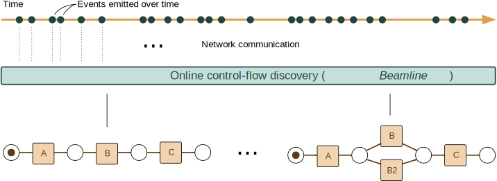

---
hide:
  - navigation
  - toc
---

  

    <h1>Beamline</h1>
    
Streaming Process Mining

  

Beamline is a framework meant to simplify the research and the development of streaming process mining, by providing a set of tools that can lift researchers from the burden of setting up streams and running experiments.

<figure markdown> 
  
</figure>

