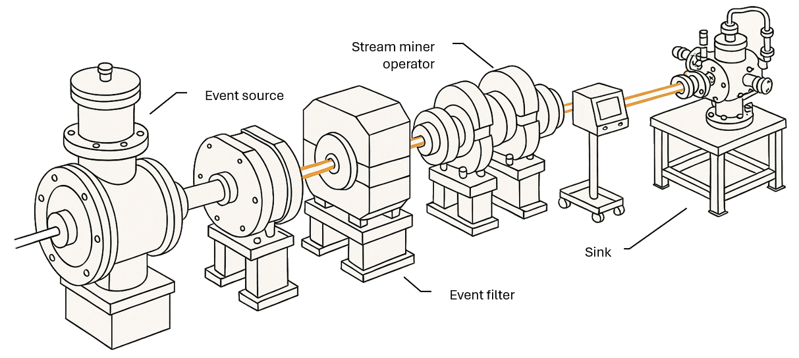

# Beamline Framework

Beamline is a framework designed to facilitate the prototyping and the development of ***streaming process mining*** algorithms.

The framework comprises both Python and Java libraries: **pyBeamline** for Python **JBeamline** Java.


pyBeamline is built on [ReactiveX](https://reactivex.io/) and its Python implementation, RxPY - a library for composing asynchronous, event-driven programs using observable sequences and pipable query operators. pyBeamline is suitable for prototyping algorithm very quickly, without necessarily bothering with performance aspects. It also simplifies collaboration by, for example, leveraging online notebook services (like Google Colab).
JBeamline, the Java library, is designed on top of [Apache Flink](https://flink.apache.org/) which makes it suitable for extremely efficient computation due to the distributed and stateful nature of its components.

[py|J]Beamline consists of algorithms, data structures, sources, and sinks to facilitate the development of streaming process mining applications. While redefining the concept of *event*, Beamline tries to maintain compatibility with OpenXES and the IEEE XES standard.

[](https://badge.fury.io/py/pybeamline)
[](https://colab.research.google.com/github/beamline/pybeamline/blob/master/tutorial.ipynb)

A complete Jupyter notebook presenting all techniques implemented in pyBeamline is available at <https://github.com/beamline/pybeamline/blob/master/tutorial.ipynb>.


!!! warning "Deveolpment of JBeamline"

    Currently the development of JBeamline is on hold whereas **pyBeamline is under active development**.


## Differences between pyBeamline and JBeamline

The main difference between JBeamline and pyBeamline is the language they are built in (JBeamline is written in Java, pyBeamline is written in Python). However, differences do not stop here. In particular, JBeamline is built on top of Apache Flink, which makes it suitable for extremely efficient computation due to the distributed and stateful nature of its components. pyBeamline, on the other end, is built on top of ReactiveX which is
> an extension of the observer pattern to support sequences of data and/or events and adds operators that allow you to compose sequences together declaratively while abstracting away concerns about things like low-level threading, synchronization, thread-safety, concurrent data structures, and non-blocking I/O. <cite>(From <https://reactivex.io/intro.html>)</cite>

Therefore, pyBeamline is suited for prototyping algorithm very quickly, without necessarily bothering with performance aspects. In a sense, it simplifies the construction of proof of concepts, before translating the algorithms into JBeamline for proper testing and verification. Also, it simplifies collaboration by, for example, leveraging online services (like Google Colab).

To give an example of such simplicity, this is the ***complete code*** to discover a DFG using a sliding window from a stream generated from a `test.xes` file (a file is used instead of a proper stream, as we are in a very controlled setting):

```python
from pybeamline.sources import xes_log_source_from_file
from pybeamline.mappers import sliding_window_to_log
from reactivex.operators import window_with_count
from pm4py import discover_dfg_typed

xes_log_source_from_file("test.xes").pipe(
    window_with_count(6),
    sliding_window_to_log()
).subscribe(lambda log: print(discover_dfg_typed(log)))
```


## On the name "*Beamline*"

The term *Beamline* is borrowed from [high energy physics](https://en.wikipedia.org/wiki/Beamline), where it indicates the physical structure used to define experiments, i.e., where the accelerated particles travel. In the streaming process mining case, Beamline is used to set up experiments where process mining events are processed and consumed.
<center>
    
</center>

Beamline comprises utility classes as well as some algorithms already implemented that can be used for comparing new techniques with the state of the art.
