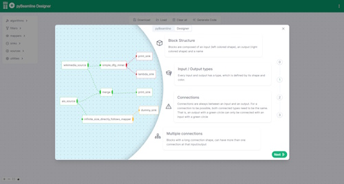

# pyBeamline Designer

To help getting started, you can try the pyBeamline Designer, available at <https://beamline.github.io/pybeamline-designer/>:

<figure markdown> 
  
  <figcaption><a href="https://beamline.github.io/pybeamline-designer/" target="_blank">https://beamline.github.io/pybeamline-designer/</a></figcaption>
</figure>

pyBeamline Designer aims to make your process mining analytics as easy as possible. Here you will be able to create diagrams resembling your own system.
