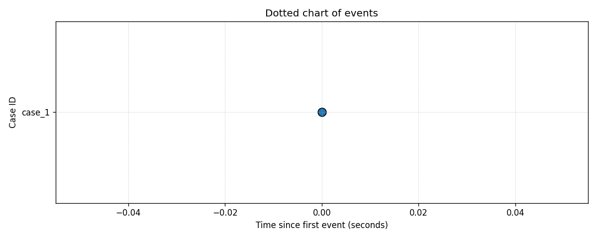

# dotted_chart_sink

Outputs the events as a dotted chart graph.

## Parameters

* **title**: `str` default: `Dotted chart of events`  
  The title of the dotted chart.
* **max_events**: `int` default: `None`  
  Max number of events to show.
* **time_window_seconds**: `int` default: `None`  
  Max time window of events to show.
* **point_size**: `int` default: `100`  
  The size of each event point.
* **show_legend**: `boolean` default: `False`  
  Whether the legend should be shown.
* **gif_path**: `str` default: `None`  
  The path where the gif of the stream should be stored. If `None` is specified, then the output is rendered on the notebook directly.
* **fps**: `int` default: `5`  
  The number of frame per seconds, in case the output is stored as a GIF.


## Example

```python
from pybeamline.sources import string_test_source
from pybeamline.sinks.dotted_chart_sink import dotted_chart_sink

log_original = ["ABCD"]*5 + ["ACBD"]*5
log_after_drift = ["AEFG"]*5 + ["AFEG"]*5

string_test_source(log_original + log_after_drift).pipe(

).sink(dotted_chart_sink(max_events=25, gif_path="test_dotted_chart_sink.gif"))
```

Output:

