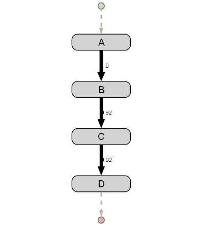

# graphviz_sink

Outputs the events considering it as a Graphviz graph.

## Parameters

* **gif_path**: `str` default: `None`  
  The path where the gif of the stream should be stored. If `None` is specified, then the output is rendered on the notebook directly.
* **fps**: `int` default: `5`  
  The number of frame per seconds, in case the output is stored as a GIF.
* **mode**: `str` default `RGB`  
  The GIF color mode.
* **bg_color**: `tuple` default: `(255, 255, 255)`  
  The background color of the GIF.
* **center**: `boolean` default: `True`  
  Whether the content should be centered.


## Example

```python
from pybeamline.sources import string_test_source
from pybeamline.algorithms.discovery.dfg_miner import simple_dfg_miner
from pybeamline.mappers.dfg_str_to_graphviz import dfg_str_to_graphviz
from pybeamline.sinks.graphviz_sink import graphviz_sink

log_original = ["ABCD"]*50 + ["ACBD"]*50
log_after_drift = ["AEFG"]*50 + ["AFEG"]*50

string_test_source(log_original + log_after_drift).pipe(
    simple_dfg_miner(model_update_frequency=50, min_relative_frequency=0.2),
    dfg_str_to_graphviz(),
).sink(graphviz_sink(gif_path='test_graphviz_sink.gif', fps=1))

```

Output:

